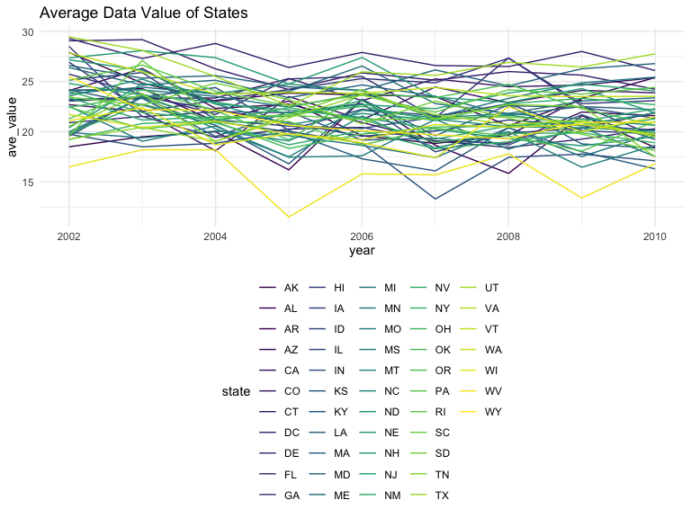

p8105_hw3_lz2950
================
Lehan Zou
2023-10-14

### Problem 0

This solution focuses on a reproducible report containing code and text
necessary for Problems 1-3, and is organized as an R Project. This was
not prepared as a GitHub repo; examples for repository structure and git
commits should be familiar from other elements of the course.

Throughout, we use appropriate text to describe our code and results,
and use clear styling to ensure code is readable.

### Problem 1

#### Read in the data

``` r
data("instacart")

instacart = 
  instacart |> 
  as_tibble()
```

#### Answer questions about the data

This dataset contains 1384617 rows and 15 columns, with each row
resprenting a single product from an instacart order. Variables include
identifiers for user, order, and product; the order in which each
product was added to the cart. There are several order-level variables,
describing the day and time of the order, and number of days since prior
order. Then there are several item-specific variables, describing the
product name (e.g. Yogurt, Avocado), department (e.g. dairy and eggs,
produce), and aisle (e.g. yogurt, fresh fruits), and whether the item
has been ordered by this user in the past. In total, there are 39123
products found in 131209 orders from 131209 distinct users.

Below is a table summarizing the number of items ordered from aisle. In
total, there are 134 aisles, with fresh vegetables and fresh fruits
holding the most items ordered by far.

``` r
instacart |> 
  count(aisle) |> 
  arrange(desc(n))
```

    ## # A tibble: 134 × 2
    ##    aisle                              n
    ##    <chr>                          <int>
    ##  1 fresh vegetables              150609
    ##  2 fresh fruits                  150473
    ##  3 packaged vegetables fruits     78493
    ##  4 yogurt                         55240
    ##  5 packaged cheese                41699
    ##  6 water seltzer sparkling water  36617
    ##  7 milk                           32644
    ##  8 chips pretzels                 31269
    ##  9 soy lactosefree                26240
    ## 10 bread                          23635
    ## # … with 124 more rows

Next is a plot that shows the number of items ordered in each aisle.
Here, aisles are ordered by ascending number of items.

``` r
instacart |> 
  count(aisle) |> 
  filter(n > 10000) |> 
  mutate(aisle = fct_reorder(aisle, n)) |> 
  ggplot(aes(x = aisle, y = n)) + 
  geom_point() + 
  labs(title = "Number of items ordered in each aisle") +
  theme(axis.text.x = element_text(angle = 60, hjust = 1))
```


Our next table shows the three most popular items in aisles
`baking ingredients`, `dog food care`, and `packaged vegetables fruits`,
and includes the number of times each item is ordered in your table.

``` r
instacart |> 
  filter(aisle %in% c("baking ingredients", "dog food care", "packaged vegetables fruits")) |>
  group_by(aisle) |> 
  count(product_name) |> 
  mutate(rank = min_rank(desc(n))) |> 
  filter(rank < 4) |> 
  arrange(desc(n)) |>
  knitr::kable()
```

| aisle                      | product_name                                  |    n | rank |
|:---------------------------|:----------------------------------------------|-----:|-----:|
| packaged vegetables fruits | Organic Baby Spinach                          | 9784 |    1 |
| packaged vegetables fruits | Organic Raspberries                           | 5546 |    2 |
| packaged vegetables fruits | Organic Blueberries                           | 4966 |    3 |
| baking ingredients         | Light Brown Sugar                             |  499 |    1 |
| baking ingredients         | Pure Baking Soda                              |  387 |    2 |
| baking ingredients         | Cane Sugar                                    |  336 |    3 |
| dog food care              | Snack Sticks Chicken & Rice Recipe Dog Treats |   30 |    1 |
| dog food care              | Organix Chicken & Brown Rice Recipe           |   28 |    2 |
| dog food care              | Small Dog Biscuits                            |   26 |    3 |

Finally is a table showing the mean hour of the day at which Pink Lady
Apples and Coffee Ice Cream are ordered on each day of the week. This
table has been formatted in an untidy manner for human readers. Pink
Lady Apples are generally purchased slightly earlier in the day than
Coffee Ice Cream, with the exception of day 5.

``` r
instacart |>
  filter(product_name %in% c("Pink Lady Apples", "Coffee Ice Cream")) |>
  group_by(product_name, order_dow) |>
  summarize(mean_hour = mean(order_hour_of_day)) |>
  pivot_wider(
    names_from = order_dow, 
    values_from = mean_hour) |>
  knitr::kable(digits = 2)
```

    ## `summarise()` has grouped output by 'product_name'. You can override using the
    ## `.groups` argument.

| product_name     |     0 |     1 |     2 |     3 |     4 |     5 |     6 |
|:-----------------|------:|------:|------:|------:|------:|------:|------:|
| Coffee Ice Cream | 13.77 | 14.32 | 15.38 | 15.32 | 15.22 | 12.26 | 13.83 |
| Pink Lady Apples | 13.44 | 11.36 | 11.70 | 14.25 | 11.55 | 12.78 | 11.94 |

## Problem 2

- data cleaning

``` r
data("brfss_smart2010")

brfss_data <- brfss_smart2010 |>
  janitor::clean_names()|>
  rename(state = locationabbr, county = locationdesc)|>
  filter(
    topic == "Overall Health",
    response %in% c('Poor', 'Fair', 'Good', 'Very good', 'Excellent')
  )|>
  mutate(
    response = factor(response, levels=c('Poor', 'Fair', 'Good', 'Very good', 'Excellent'))) |>
  arrange(response)
```

- In 2002, which states were observed at 7 or more locations? What about
  in 2010?

``` r
states_2002 = brfss_data |>
  filter(year == 2002) |>
  group_by(state) |>
  summarize(
    n = n_distinct(county)
  )|>
  filter(n >= 7 )

states_2010 = brfss_data |>
  filter(year == 2010) |>
  group_by(state) |>
  summarize(
    n = n_distinct(county)
  )|>
  filter(n >= 7 )
```

In 2002, CT, FL, MA, NC, NJ, PA were observed at 7 or more locations. In
2010, CA, CO, FL, MA, MD, NC, NE, NJ, NY, OH, PA, SC, TX, WA were
observed at 7 or more locations.

- Construct a dataset that is limited to Excellent responses, and
  contains, year, state, and a variable that averages the data_value
  across locations within a state.

``` r
excellent = brfss_data |>
  filter(response == "Excellent") |>
  group_by(year, state) |>
  summarise(ave_value = mean(data_value, na.rm = T))
```

    ## `summarise()` has grouped output by 'year'. You can override using the
    ## `.groups` argument.

The resulting data set contains 443 observations and 3 variables.

- Make a “spaghetti” plot of this average value over time within a
  state.

``` r
excellent |>
  ggplot(aes(x = year, y = ave_value, color = state)) + 
  geom_line() +
  labs(title = "Average Data Value of States")
```


This line plot using different color from purple to yellow indicating
different states and showing their average data value over time.

- Finally, make a two-panel plot showing, for the years 2006, and 2010,
  distribution of `data_value` for responses (“Poor” to “Excellent”)
  among locations in NY State.

``` r
brfss_data |>
  filter(state == "NY" & year %in% c(2006, 2010))|>
  ggplot(aes(x = response, y = data_value, color = year)) +
  geom_boxplot() +
  facet_grid(year ~ .) +
  labs(title = "Distribution of Data Value for Responses Among locations in 2006 and 2010",
       x = "Response",
       y = "Data Value")
```


The box plot shows data values in year 2006 and 2010 follows similar
distribution while the value in 2010 of each response are higher than
2006. Yet they share the same trend with the value increasing from
“Poor” to “Very good” but decreasing from “Very good” to “Excellent”.

## Problem 3

- Load, tidy, merge, and otherwise organize the data sets.

``` r
edu_mapping <- c("Less than high school","High school equivalent", "More than high school")
sex_mapping <- c("male", "female")

covar = 
  read_csv("data/nhanes_covar.csv", skip = 4) |> 
  janitor::clean_names() |> 
  filter(age >= 21) |> #exclude participants less than 21 years of age
  drop_na() |> #remove NA values
  #encode data with reasonable variable classes 
  mutate(
      education = factor(edu_mapping[education], levels = edu_mapping),
      sex = factor(sex_mapping[sex], levels = sex_mapping)
  )
```

    ## Rows: 250 Columns: 5
    ## ── Column specification ────────────────────────────────────────────────────────
    ## Delimiter: ","
    ## dbl (5): SEQN, sex, age, BMI, education
    ## 
    ## ℹ Use `spec()` to retrieve the full column specification for this data.
    ## ℹ Specify the column types or set `show_col_types = FALSE` to quiet this message.

``` r
accel = 
  read_csv("data/nhanes_accel.csv") |>
  janitor::clean_names() |> 
  pivot_longer(
    min1:min1440,
    names_to = "minute",
    values_to = "MIMS_Value",
    names_prefix = "min")
```

    ## Rows: 250 Columns: 1441
    ## ── Column specification ────────────────────────────────────────────────────────
    ## Delimiter: ","
    ## dbl (1441): SEQN, min1, min2, min3, min4, min5, min6, min7, min8, min9, min1...
    ## 
    ## ℹ Use `spec()` to retrieve the full column specification for this data.
    ## ℹ Specify the column types or set `show_col_types = FALSE` to quiet this message.

``` r
nhanes_merge = 
  left_join(covar, accel, by = "seqn")
```

The merged dataset contains 328320 observations and 7 variables related
to 1440 minutes of MIMS value of 228 participants.

- Produce a reader-friendly table for the number of men and women in
  each education category, and create a visualization of the age
  distributions for men and women in each education category. Comment on
  these items

``` r
covar |> 
  count(education, sex) |> 
  pivot_wider(
    names_from = sex,
    values_from = n
  ) |> 
  knitr::kable()
```

| education              | male | female |
|:-----------------------|-----:|-------:|
| Less than high school  |   27 |     28 |
| High school equivalent |   35 |     23 |
| More than high school  |   56 |     59 |

From the table we clearly see that Less than high school and higher than
high school education history among women and men are about the same
while there are less women under high school equivalent than men.

- Create a visualization of the age distributions for men and women in
  each education category.

``` r
nhanes_merge |> 
  ggplot(aes(x = education, y = age, fill = sex)) +
  geom_boxplot() +
  labs(
    title = "Age distribution for men and women in each education category",
    x = "Education",
    y = "Age")
```


\* Using the tidied data set, aggregate across minutes to create a total
activity variable for each participant.

``` r
activity = 
  nhanes_merge |> 
  group_by(seqn, sex, age, education) |> 
  summarise(activity = sum(MIMS_Value))
```

    ## `summarise()` has grouped output by 'seqn', 'sex', 'age'. You can override
    ## using the `.groups` argument.

Plot

``` r
activity |> 
  ggplot(aes(x = age, y = activity, color = sex)) +
  geom_point() +
  geom_smooth() +
  facet_grid(education~.) +
  labs(title = "Daily MIMS Activity among Ages")
```

    ## `geom_smooth()` using method = 'loess' and formula 'y ~ x'


The plot shows activity score decreases for both men and women as age
increases for all educational level. More specifically, female has
higher activity score than men in high school equivalent and more than
high school educational level.

- Finally, make a three-panel plot that shows the 24-hour activity time
  courses for each education level and use color to indicate sex.

``` r
nhanes_merge|> 
  ggplot(aes(x = minute, y = MIMS_Value, color = sex)) +
  geom_point() +
  geom_smooth() +
  facet_grid(education ~ .) +
  theme_minimal()+
  labs(title = "MIMS Activity per Minute")
```

    ## `geom_smooth()` using method = 'loess' and formula 'y ~ x'


This plot shows similar trend for both female and male among different
educational level.
